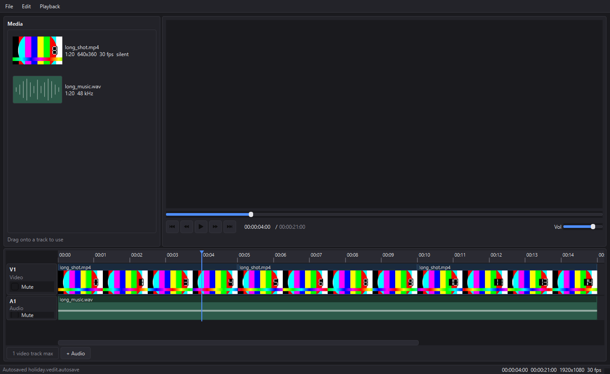

# VidEditor

An offline desktop non-linear video editor. Python 3.12, PySide6, and a
vendored FFmpeg. It imports media, cuts it on a timeline, plays the result
back with audio, and exports an H.264/AAC MP4. Nothing it does needs a
network, and it never looks for an FFmpeg other than the one it ships with.



*The preview stage is black in that capture because the video surface is
composited by the graphics stack rather than painted into the widget tree, so
a screenshot taken by the application of itself does not include the frame.
It is there on screen.*

---

## What it does

- Import media by dialog or by dropping files onto the window; every file is
  probed on a background thread, and the bin fills in as the answers arrive.
- Drag from the bin onto a track to place a full-length clip.
- Move, trim, split, duplicate, delete and set the gain of clips. Snapping to
  the frame grid and to clip edges; overlaps are refused rather than resolved.
- Undo and redo everything, one entry per completed gesture.
- Play the timeline with audio, scrub it, and step it a frame at a time.
- Save and open projects as JSON. Autosave, recent files, and recovery after
  a session that did not finish.
- Relink media that has moved.
- Export with a resolution preset, a quality preset, and optionally the GPU.

---

## Running it

```
.venv\Scripts\activate
python app.py                  # the application
python app.py holiday.vedit    # with a project open
pytest                         # all tests
pytest -m "not slow"           # skip the ones that actually encode media
```

Python 3.12, PySide6 6.11, pydantic 2.13, numpy 2.5, Pillow 12.3, pytest 9.1.

FFmpeg is vendored at `bin/ffmpeg.exe` and `bin/ffprobe.exe` (the 2026-07-16
gyan.dev essentials build). It is not in git; drop it in before building.

---

## How it is put together

```
core/     the editor, with no user interface at all
  timebase.py     ticks, frame rates, timecode
  model.py        Project / Track / Clip, and nothing else
  commands.py     every edit, as an undoable command
  filtergraph.py  Project -> an FFmpeg filter graph
  render.py       running FFmpeg
  probe.py        reading a media file
  project_io.py   saving and loading
  media_check.py  finding media that has moved
  encoders.py     which encoders this machine can use
  binaries.py     where the vendored FFmpeg is

ui/       everything that draws
  main_window.py  the shell, the menus, the project lifecycle
  timeline/       the scene, the items, the gestures
  workers/        background jobs: probes, thumbnails, waveforms, the audio bed
  playback_controller.py, video_stage.py, preview_panel.py
  export_dialog.py, relink_dialog.py, settings.py
```

### `core/` never imports Qt

Not as a style preference: as an enforced invariant, with a test that walks
the imports. The point is that the interesting parts of an editor — what an
edit means, what a project is, how a timeline becomes an FFmpeg command — are
decidable without a window. They can be tested in milliseconds, in bulk, with
no event loop, no offscreen platform plugin and no widget lifetimes to manage.
Around 390 of this project's 1130 tests never construct a QApplication, and
they are the ones that cover what an edit actually means.

The dependency goes one way only. `ui/` calls into `core/`; `core/` does not
know `ui/` exists. Anything that needs to travel the other way is a signal or
a callback the UI installs.

### Time is an integer number of ticks

`TICKS_PER_SECOND = 120000`. Every time value in the model, in every command,
and in every signal is an integer count of these. There are exactly three
floats in the codebase — `gain_db`, `pixels_per_second`, and values on their
way out to a display string or an FFmpeg argument — and each is a deliberate
one-way exit from the tick domain.

**Why 120000 and not 90000.** 90000 is the MPEG-2 and RTP clock, and the
obvious choice. It is wrong here because it does not divide the NTSC rates. At
24000/1001 fps one frame is `90000 * 1001 / 24000 = 3753.75` ticks, and at
60000/1001 it is 1501.5. A frame duration that lands on a fraction of a tick
reintroduces exactly the accumulating rounding drift that an integer timebase
exists to remove — you place a hundred cuts and the hundredth is a frame out.

120000 divides by 1000 and by 24, 25, 30, 50, 60 and 120, so every broadcast
rate lands on a whole number:

| fps | ticks per frame |  | fps | ticks per frame |
|---|---|---|---|---|
| 24 | 5000 | | 24000/1001 | 5005 |
| 25 | 4800 | | 30000/1001 | 4004 |
| 30 | 4000 | | 60000/1001 | 2002 |
| 50 | 2400 | | 120 | 1000 |

Divisibility by 1000 matters separately: `QMediaPlayer` reports and accepts
milliseconds, and a millisecond is exactly 120 ticks, so the one boundary the
application cannot avoid crossing is exact in both directions.

Real files are less tidy than the table. A variable frame rate recording
probes to whatever average ffprobe computed, something like 24249/1000, and
120000 does not divide that at all. So a frame rate is stored as an exact
rational `FrameRate(num, den)` and `ticks_per_frame` returns a `Fraction`.
Nothing anywhere may assume it is a whole number.

### The edit model on disk

A project is JSON. Source paths are written relative to the project file when
the media sits under the same tree, so a project folder can be copied whole,
and absolute otherwise. Both resolve back to absolute on load.

```json
{
  "schema_version": 2,
  "project": {
    "name": "holiday",
    "width": 1920,
    "height": 1080,
    "frame_rate": {"num": 30, "den": 1},
    "sample_rate": 48000,
    "tracks": [
      {
        "id": "6f1c...",
        "name": "V1",
        "kind": "video",
        "muted": false,
        "clips": [
          {
            "id": "a83b...",
            "src": "media/shot.mp4",
            "src_in": 0,
            "src_out": 480000,
            "timeline_start": 0,
            "gain_db": 0.0
          }
        ]
      }
    ]
  }
}
```

A clip is a span of a source file (`src_in` to `src_out`, in ticks) placed at
`timeline_start`. Its length is implied, never stored, so there is no second
copy of it to disagree. Tracks are sorted by `timeline_start` and validated to
be non-overlapping on load, so an edited-by-hand file that overlaps two clips
is rejected rather than half-rendered. `schema_version` is checked exactly:
this build reads 2 and says so about anything else.

### The filter graph compiler

`core/filtergraph.py` turns a `Project` into `(inputs, filter_complex, maps)`.
It is pure string construction — nothing in it runs FFmpeg — which is why
there are nearly 600 lines of tests for it that execute in under a second.

Each track is laid out as segments: every clip, and every gap between clips,
in timeline order, tiling the span with no holes. A clip segment becomes a
`trim` / `setpts` / `scale` / `pad` / `fps` / `format` chain; a gap becomes a
`color` (or `anullsrc`) source of exactly the right duration. The segments are
then `concat`ed into one stream per track, and the audio tracks are mixed with
`amix` and padded to the full project duration with `apad`.

Two entry points share all of that. `build_full` produces the export graph;
`build_audio_only` produces the preview audio bed and differs in exactly one
way — the video branch is not built, so files that carry only video never
become inputs. The audio branch is identical in both, down to the trailing
pad, because **the bed is meant to be the export's audio**. If the preview and
the export disagreed about audio, the preview would stop being a preview.

Ticks become seconds at the last possible moment, and both ends of a span are
snapped to the frame grid before subtracting, so adjacent segments still tile
exactly after quantisation.

### Playback: the audio is the clock

The hard problem in an NLE preview is not decoding, it is agreement. Two
streams playing at once will drift, and something has to be right.

Here the audio is right. Every edit that touches an audio track invalidates a
pre-rendered WAV of the entire audio timeline, and 500ms after the edits stop
a new one is rendered in the background. During playback **that file's
position is the timeline position**. The video is corrected to it and never
the other way round. A frame arriving late is a frame the viewer might not
notice; audio that stutters, resamples or gaps is immediately obvious.

Consequences worth stating:

- The video players are deliberately silent. There is exactly one audio output
  in the application. A second one would be a second clock with no way to say
  which was right.
- Playback never waits for a bed. Until one exists, or when a project has no
  audio at all, a `QElapsedTimer` drives the position instead, and the bed
  takes over the moment it lands.
- The drift tolerance is 250ms, which is deliberately loose. A correction is a
  seek, and a seek is visible; correcting a 40ms discrepancy would look worse
  than the discrepancy. Positions the *user* chose — a seek, a scrub, a cut —
  are placed exactly instead.

**Measured**: video-to-audio offset after 60 seconds of continuous playback
was **−41 ms**, about 1.2 frames at 30fps and well inside the tolerance.
Caveat on that number: it is `QMediaPlayer.position()` minus the bed position,
and `QMediaPlayer.position()` is itself coarse — it updates on its own
schedule and lags the frame actually on screen. −41 ms is the reported offset,
not a measurement of the photons; the true figure is smaller than the
measurement's own resolution can resolve.

### The video stage is double buffered

A cut is not a load. Two `QMediaPlayer`s sit in a `QStackedWidget`: one is
playing the current clip while the other is already loaded and seeked to the
first frame of the next one. At the cut, the standby is raised. Loading a file
takes hundreds of milliseconds; raising a widget does not.

**Measured**: cut times of **1.3 to 13.7 ms** across a four-clip timeline,
every one under a single 33 ms frame, with three of the four on the fast path
and zero black frames mid-playback. The bed player receives nothing but
`setPosition`, `play` and `pause` for an entire run, which is the strongest
available evidence that the audio does not gap at a cut.

One Qt trap is worth writing down because it cost real time: `setSource` with
a URL that is already open does **not** re-emit `LoadedMedia`, so a seek
issued while waiting for that status is silently dropped and the player stays
on the previous frame. Scrubbing backwards across a split hits it every time,
because every clip of a split is the same file.

---

## Known limitations

**One video track.** This is a scope decision, not an oversight. The exporter
refuses a second video track carrying clips, the "+ Video" button becomes
"1 video track max" when one exists, and the reason is that two video tracks
mean **compositing**: an `overlay` chain, per-clip opacity, blend modes, and a
z-order the model would have to carry. That is a feature, not a relaxed
constraint, and it is the single thing that would lift this limitation.
Everything else in the design is already ready for it — the audio branch mixes
any number of tracks today.

Also:

- **No transitions or effects.** Cuts only. The filter graph compiler has the
  shape to grow them; the UI for them does not exist.
- **No scrub audio.** Dragging the playhead moves the picture and leaves the
  audio silent.
- **Frame-accurate scrubbing is only as accurate as `QMediaPlayer`.** Seeks
  land on the nearest keyframe-decodable position, not always the exact frame.
  A real frame server (a decoder thread and a ring buffer, replacing
  `QMediaPlayer` entirely) is what fixes that, and it is a different project.
- **An unsaved project does not autosave.** The autosave is a sidecar beside
  the project file, so a project that has never been saved has nowhere to put
  one.
- **The audio bed is a whole-timeline render.** Long projects mean a longer
  wait after each audio edit, debounced to 500ms and cancelled on the next
  edit, but still linear in project length.
- **Hardware encoding needs a recent driver.** See below.

### Hardware encoding

The export dialog offers NVENC when the machine can actually use it, and
otherwise does not mention it at all. "Can actually use it" is two questions:
whether the vendored FFmpeg was built with the encoder, which is a fact about
the build and is the same everywhere, and whether it opens on this machine's
GPU and driver, which is not. Both are asked; the second is a single frame of
black encoded to nothing and takes about 40 ms, on a background thread at
startup.

On the development machine the answer is currently no, and the reason is
instructive: the GPU is there, but this FFmpeg build requires NVENC API 13.1
(driver 610.00 or newer) and the installed driver provides 13.0. Listing the
encoder would have offered a checkbox that fails at the first export.

---

## Building

```
build.bat
```

which is:

```
.venv\Scripts\activate && pyinstaller build.spec --noconfirm
```

The result is `dist\videditor\`, a one-folder build containing the interpreter,
Qt, and both FFmpeg binaries. It needs no Python on the machine that runs it.

One-folder rather than one-file on purpose: a one-file build unpacks its entire
payload — 200 MB of FFmpeg included — into a temporary directory on every
launch, which is slower every single time in exchange for looking tidier once.

`core/binaries.py` resolves the vendored binaries under `sys._MEIPASS` first,
so the same code finds them in a frozen build and in a source checkout.

**Size: 354 MiB (371 MB).** FFmpeg is 196 MB of that; the two binaries in this
build are statically linked and about 100 MB each. Qt is 114 MB after the
excluded modules are dropped. The spec also prunes a group of Qt libraries the
PySide6 hook copies whether or not anything imports them (Quick, Qml, Pdf,
VirtualKeyboard — all verified to have no dependents outside their own group),
which is worth about 17 MB. `opengl32sw.dll` is deliberately kept, at 20 MB:
nothing links to it because Qt loads it by name when a machine has no usable
OpenGL driver, and a video editor that will not start on such a machine is
worse than a folder 20 MB larger.
